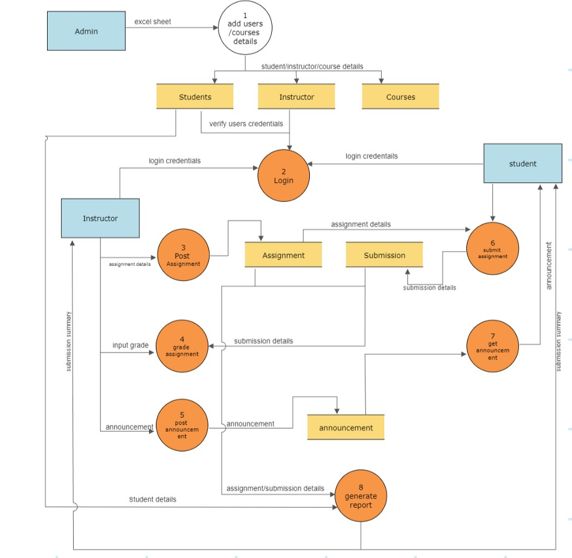
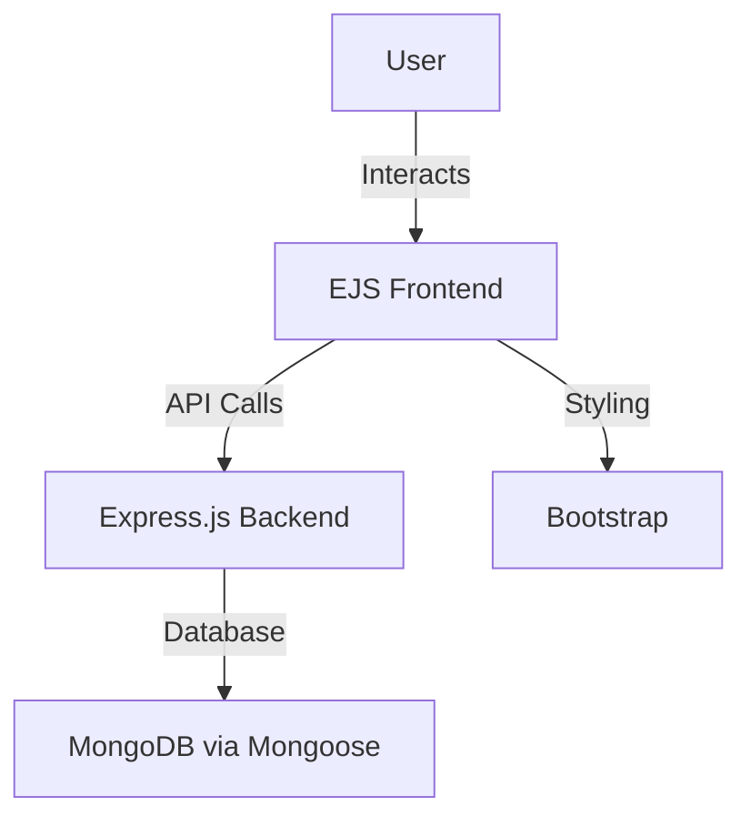

# 📚 Online Assignment Management System

A web-based platform designed to streamline assignment management for schools and universities. Teachers can create, publish, and grade assignments, while students can submit their work online, fostering an efficient and organized academic workflow.

---

## ✨ Features

- **User Authentication**: Secure login and registration for users.
- **User Roles**: Distinct roles for teachers and students with tailored functionalities.
- **Assignment Creation & Publishing**: Teachers can create and share assignments with ease.
- **Assignment Submission**: Students can upload completed assignments online.
- **Assignment Grading & Feedback**: Teachers can grade submissions and provide feedback.
- **Course Management**: Teachers can organize and manage courses effectively.
- **Reports**: Generate insightful reports for both teachers and students.

---

## 🛠️ Technologies Used

- **Node.js**: JavaScript runtime for server-side logic.
- **Express.js**: Framework for building robust API endpoints.
- **MongoDB**: NoSQL database for storing user, course, and assignment data.
- **Mongoose**: ODM library for MongoDB to streamline data modeling.
- **EJS**: Templating engine for dynamic HTML rendering.
- **Bootstrap**: Front-end framework for responsive and modern UI design.

---

## 📊 Data Flow Diagram (DFD)



---

## 🚀 Installation

1. **Clone the Repository**:
   ```bash
   git clone https://github.com/your-username/online-assignment-management-system.git
   cd online-assignment-management-system
   ```

2. **Install Dependencies**:
   ```bash
   npm install
   ```

3. **Set Environment Variables**:
   Create a `.env` file in the root directory with the following:
   ```
   MONGODB_URI=your_mongodb_connection_string
   PORT=5000
   ```

4. **Start the Application**:
   ```bash
   npm start
   ```

   The application will be available at `http://localhost:5000`.

---

## 🧑‍💻 System Architecture


